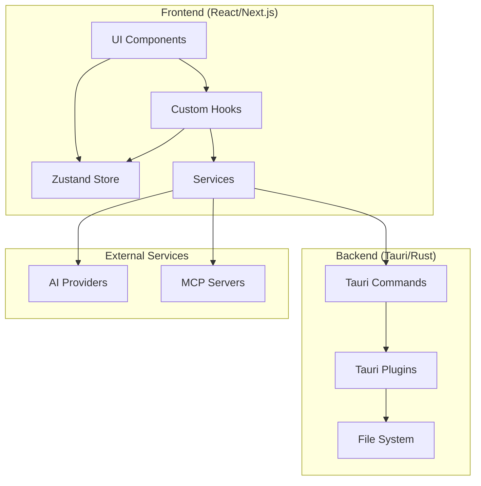
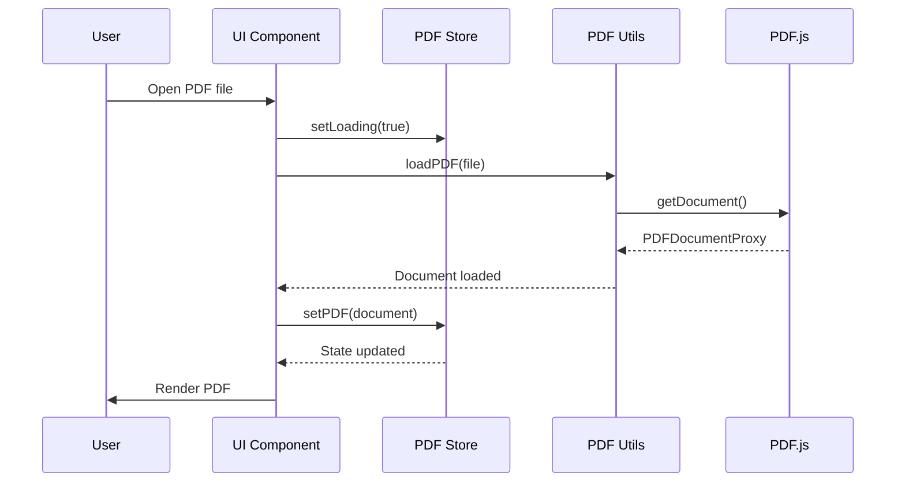
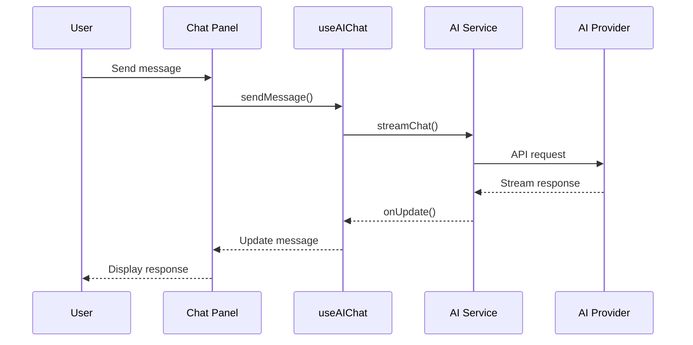

# Architecture Overview

SAST Readium is built with a modern, modular architecture that supports both web and desktop deployment from a single codebase.

## High-Level Architecture



## Core Technologies

### Frontend Stack

| Technology          | Purpose                         |
| ------------------- | ------------------------------- |
| **Next.js 16**      | React framework with App Router |
| **React 19**        | UI component library            |
| **TypeScript**      | Type-safe JavaScript            |
| **Tailwind CSS v4** | Utility-first CSS framework     |
| **shadcn/ui**       | Accessible UI components        |
| **Zustand**         | Lightweight state management    |
| **PDF.js**          | PDF rendering engine            |
| **react-i18next**   | Internationalization            |

### Desktop Stack

| Technology    | Purpose                       |
| ------------- | ----------------------------- |
| **Tauri 2.9** | Desktop application framework |
| **Rust**      | Backend language              |
| **WebView**   | Renders web content natively  |

### AI Stack

| Technology        | Purpose                   |
| ----------------- | ------------------------- |
| **Vercel AI SDK** | AI integration framework  |
| **MCP Protocol**  | Tool integration standard |
| **Zod**           | Schema validation         |

## Application Layers

### 1. Presentation Layer

React components organized by feature:

- `components/pdf-viewer/` - PDF viewing and interaction
- `components/ai-sidebar/` - AI chat interface
- `components/ui/` - Reusable UI primitives
- `components/welcome-page/` - Initial landing screen

### 2. State Layer

Zustand stores for application state:

- `lib/pdf-store.ts` - PDF document state, annotations, bookmarks
- `lib/ai-chat-store.ts` - AI conversation history, settings
- `lib/custom-theme-store.ts` - Custom theme definitions

### 3. Service Layer

Business logic and external integrations:

- `lib/ai-service.ts` - AI text generation, tool calling
- `lib/pdf-utils.ts` - PDF.js wrapper utilities
- `lib/tauri-bridge.ts` - Tauri command wrappers
- `lib/mcp-client.ts` - MCP protocol client

### 4. Platform Layer

Platform-specific implementations:

- **Web**: Service workers, IndexedDB, Web APIs
- **Desktop**: Tauri commands, native file system, OS integration

## Data Flow

### PDF Loading Flow



### AI Chat Flow



## Platform Abstraction

SAST Readium uses a platform abstraction layer to support both web and desktop:

```typescript
// lib/tauri-bridge.ts
export async function openFile(): Promise<File | null> {
  if (isTauri()) {
    // Use Tauri file dialog
    const path = await open({
      filters: [{ name: "PDF", extensions: ["pdf"] }],
    });
    return readFile(path);
  } else {
    // Use browser file input
    return showFilePicker();
  }
}
```

### Platform Detection

```typescript
export function isTauri(): boolean {
  return typeof window !== "undefined" && "__TAURI__" in window;
}
```

## Security Model

### Web Security

- Content Security Policy (CSP) headers
- HTTPS-only in production
- Secure cookie handling
- XSS prevention via React

### Desktop Security

- Minimal Tauri capabilities
- Scoped file system access
- No arbitrary command execution
- Secure IPC communication

### API Key Security

- Keys stored in browser's Web Crypto API (web)
- OS credential management (desktop)
- Never exposed in client-side code
- Environment variables for server-side

## Performance Considerations

### PDF Rendering

- Virtual scrolling for large documents
- Page-level lazy loading
- Canvas caching for rendered pages
- Web Workers for heavy operations

### State Management

- Zustand's minimal re-render approach
- Selective state subscriptions
- Persist middleware for localStorage
- Debounced state updates

### Bundle Optimization

- Next.js automatic code splitting
- Dynamic imports for large components
- Tree shaking for unused code
- Image optimization via Next.js

## Next Steps

- [Project Structure](project-structure.md) - Detailed file organization
- [State Management](state-management.md) - Zustand store patterns
- [Styling & Theming](styling.md) - CSS architecture
