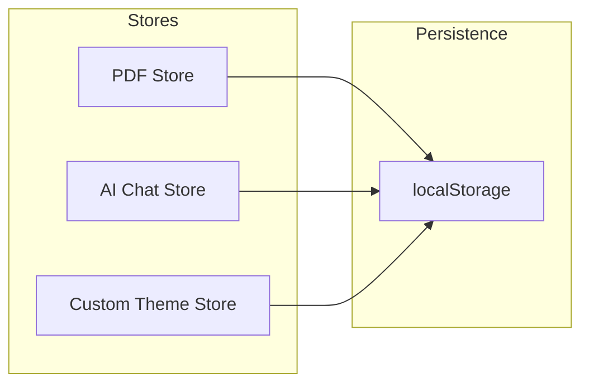

# State Management

SAST Readium uses [Zustand](https://zustand-demo.pmnd.rs/) for state management, providing a lightweight, TypeScript-friendly approach with built-in persistence.

## Why Zustand?

- **Minimal boilerplate**: No providers, reducers, or actions required
- **TypeScript-first**: Excellent type inference
- **Selective subscriptions**: Components only re-render when their subscribed state changes
- **Persistence**: Built-in middleware for localStorage
- **DevTools**: Redux DevTools integration

## Store Architecture



## PDF Store

The main store for PDF document state, located in `lib/pdf-store.ts`.

### State Structure

```typescript
interface PDFState {
  // Document
  pdfUrl: string | null;
  numPages: number;
  currentPage: number;
  metadata: PDFMetadata | null;

  // View settings
  zoom: number;
  rotation: number;
  viewMode: "single" | "continuous" | "twoPage";
  fitMode: "custom" | "fitWidth" | "fitPage";
  themeMode: "light" | "dark" | "sepia" | "auto";

  // UI state
  isFullscreen: boolean;
  showThumbnails: boolean;
  showOutline: boolean;
  showAnnotations: boolean;

  // Annotations
  annotations: Annotation[];
  annotationHistory: AnnotationHistory;
  selectedAnnotationColor: string;

  // Bookmarks
  bookmarks: Bookmark[];

  // Search
  searchQuery: string;
  searchResults: SearchResult[];
  currentSearchIndex: number;

  // TTS
  isReading: boolean;
  speechRate: number;
  speechVolume: number;

  // Watermark
  watermarkText: string;
  watermarkColor: string;
  watermarkOpacity: number;
}
```

### Actions

```typescript
interface PDFActions {
  // Navigation
  setCurrentPage: (page: number) => void;
  nextPage: () => void;
  previousPage: () => void;
  goToPage: (page: number) => void;

  // Zoom
  setZoom: (zoom: number) => void;
  zoomIn: () => void;
  zoomOut: () => void;
  resetZoom: () => void;

  // Annotations
  addAnnotation: (annotation: Annotation) => void;
  updateAnnotation: (id: string, updates: Partial<Annotation>) => void;
  deleteAnnotation: (id: string) => void;
  undoAnnotation: () => void;
  redoAnnotation: () => void;

  // Bookmarks
  addBookmark: (bookmark: Bookmark) => void;
  deleteBookmark: (id: string) => void;
}
```

### Usage Example

```typescript
import { usePDFStore } from "@/lib/pdf-store";

function PageNavigator() {
  // Subscribe to specific state
  const currentPage = usePDFStore((state) => state.currentPage);
  const numPages = usePDFStore((state) => state.numPages);
  const nextPage = usePDFStore((state) => state.nextPage);
  const previousPage = usePDFStore((state) => state.previousPage);

  return (
    <div>
      <button onClick={previousPage} disabled={currentPage <= 1}>
        Previous
      </button>
      <span>{currentPage} / {numPages}</span>
      <button onClick={nextPage} disabled={currentPage >= numPages}>
        Next
      </button>
    </div>
  );
}
```

### Persistence

The PDF store persists selected state to localStorage:

```typescript
export const usePDFStore = create<PDFState & PDFActions>()(
  persist(
    (set, get) => ({
      // ... state and actions
    }),
    {
      name: "pdf-store",
      partialize: (state) => ({
        // Only persist these fields
        themeMode: state.themeMode,
        viewMode: state.viewMode,
        recentFiles: state.recentFiles,
        bookmarks: state.bookmarks,
      }),
    }
  )
);
```

## AI Chat Store

Manages AI conversation state, located in `lib/ai-chat-store.ts`.

### State Structure

```typescript
interface AIChatState {
  // Conversations
  conversations: Conversation[];
  activeConversationId: string | null;

  // Provider settings
  provider: AIProvider;
  model: string;
  apiKey: string;
  temperature: number;
  maxTokens: number;

  // Features
  enableTools: boolean;
  enableMultiStep: boolean;
  mcpServers: MCPServerConfig[];

  // UI
  isOpen: boolean;
  activeTab: "chat" | "settings" | "tools" | "history";
}
```

### Secure API Key Storage

API keys are encrypted before storage:

```typescript
// Encrypt API key before storing
const encryptedKey = await encryptApiKey(apiKey);
set({ encryptedApiKey: encryptedKey });

// Decrypt when needed
const apiKey = await decryptApiKey(state.encryptedApiKey);
```

## Custom Theme Store

Manages custom color themes, located in `lib/custom-theme-store.ts`.

### State Structure

```typescript
interface CustomThemeState {
  themes: CustomTheme[];
  activeThemeId: string | null;
  presets: CustomTheme[];
}

interface CustomTheme {
  id: string;
  name: string;
  description?: string;
  colors: CustomThemeColors;
  radius: number;
  createdAt: number;
  updatedAt: number;
}
```

### Theme Application

```typescript
function applyCustomTheme(theme: CustomTheme) {
  const root = document.documentElement;

  Object.entries(theme.colors).forEach(([key, value]) => {
    root.style.setProperty(`--${key}`, value);
  });

  root.style.setProperty("--radius", `${theme.radius}rem`);
}
```

## Best Practices

### 1. Selective Subscriptions

Subscribe only to the state you need:

```typescript
// ✅ Good: Only re-renders when currentPage changes
const currentPage = usePDFStore((state) => state.currentPage);

// ❌ Bad: Re-renders on any state change
const state = usePDFStore();
```

### 2. Shallow Comparison

Use `shallow` for object/array subscriptions:

```typescript
import { shallow } from "zustand/shallow";

const { annotations, bookmarks } = usePDFStore(
  (state) => ({
    annotations: state.annotations,
    bookmarks: state.bookmarks,
  }),
  shallow
);
```

### 3. Actions Outside Components

Access actions without subscribing to state:

```typescript
// Get action without subscribing
const addBookmark = usePDFStore.getState().addBookmark;

// Use in event handler
function handleAddBookmark() {
  addBookmark({ id: nanoid(), pageNumber: 1, title: "My Bookmark" });
}
```

### 4. Computed Values

Derive values in selectors:

```typescript
const hasAnnotations = usePDFStore((state) => state.annotations.length > 0);

const pageAnnotations = usePDFStore((state) =>
  state.annotations.filter((a) => a.pageNumber === state.currentPage)
);
```

## Testing Stores

### Mocking Store State

```typescript
import { usePDFStore } from "@/lib/pdf-store";

beforeEach(() => {
  usePDFStore.setState({
    currentPage: 1,
    numPages: 10,
    annotations: [],
  });
});

test("navigates to next page", () => {
  usePDFStore.getState().nextPage();
  expect(usePDFStore.getState().currentPage).toBe(2);
});
```

### Testing Components with Store

```typescript
import { render, screen } from "@testing-library/react";
import { usePDFStore } from "@/lib/pdf-store";

test("displays current page", () => {
  usePDFStore.setState({ currentPage: 5, numPages: 10 });

  render(<PageNavigator />);

  expect(screen.getByText("5 / 10")).toBeInTheDocument();
});
```

## DevTools Integration

Enable Redux DevTools in development:

```typescript
import { devtools } from "zustand/middleware";

const usePDFStore = create<PDFState>()(
  devtools(
    persist(
      (set) => ({
        // ... state
      }),
      { name: "pdf-store" }
    ),
    { name: "PDF Store" }
  )
);
```
