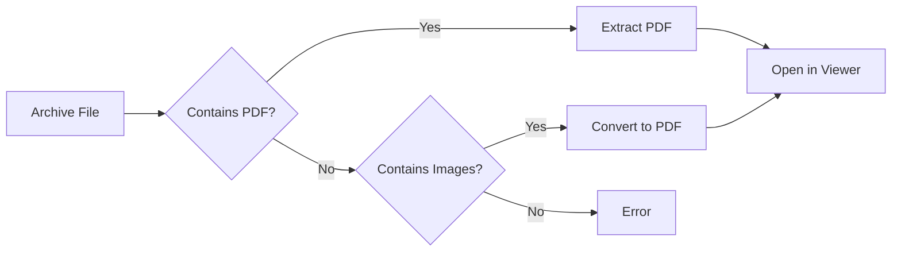

# Archive Support

SAST Readium can open and read PDF files directly from compressed archives, including support for comic book formats.

## Supported Formats

| Format  | Extension | Description           |
| ------- | --------- | --------------------- |
| **ZIP** | `.zip`    | Standard ZIP archives |
| **CBZ** | `.cbz`    | Comic Book ZIP format |
| **RAR** | `.rar`    | RAR archives          |
| **CBR** | `.cbr`    | Comic Book RAR format |

## How It Works

### Opening Archives

1. Drag and drop an archive file
2. Or click "Open File" and select archive
3. SAST Readium extracts and opens the content

### Extraction Process



### PDF Extraction

If the archive contains PDF files:

1. PDFs are extracted to memory
2. First PDF is opened automatically
3. Multiple PDFs show selection dialog

### Image Conversion

For comic book archives (CBZ/CBR) with images:

1. Images are extracted in order
2. Converted to a single PDF using pdf-lib
3. Maintains original image quality
4. Preserves page order

## Comic Book Support

### CBZ Format

Comic Book ZIP files typically contain:

- Sequential image files (JPG, PNG)
- Named for page order (001.jpg, 002.jpg, etc.)
- Optional metadata files

### CBR Format

Comic Book RAR files:

- Same structure as CBZ
- Uses RAR compression
- Extracted using node-unrar-js

### Image Formats

Supported image types in archives:

- JPEG (.jpg, .jpeg)
- PNG (.png)
- GIF (.gif)
- WebP (.webp)
- BMP (.bmp)

## Usage

### Drag and Drop

1. Drag archive file to the app window
2. Drop on the drop zone
3. Wait for extraction
4. View the content

### File Dialog

1. Click "Open File"
2. Select archive from file picker
3. Confirm selection
4. Content opens automatically

### Recent Files

Archives appear in recent files:

- Shows archive name
- Remembers reading position
- Quick re-open

## Technical Details

### ZIP Handling

Uses JSZip library:

```typescript
import JSZip from "jszip";

async function extractZip(file: File): Promise<File | null> {
  const zip = await JSZip.loadAsync(file);
  // Find and extract PDF or images
}
```

### RAR Handling

Uses node-unrar-js for browser:

```typescript
import { createExtractorFromData } from "node-unrar-js";

async function extractRar(file: File): Promise<File | null> {
  const extractor = await createExtractorFromData({ data: buffer });
  // Extract files from RAR
}
```

### Image to PDF

Uses pdf-lib for conversion:

```typescript
import { PDFDocument } from "pdf-lib";

async function imagesToPdf(images: Uint8Array[]): Promise<Uint8Array> {
  const pdfDoc = await PDFDocument.create();
  for (const imageData of images) {
    const image = await pdfDoc.embedJpg(imageData);
    const page = pdfDoc.addPage([image.width, image.height]);
    page.drawImage(image, { x: 0, y: 0 });
  }
  return pdfDoc.save();
}
```

## Performance

### Memory Usage

- Archives are processed in memory
- Large archives may use significant RAM
- Extracted content is not cached to disk

### Processing Time

Depends on:

- Archive size
- Number of files
- Compression level
- Image conversion (if needed)

### Optimization

- Progress indicator during extraction
- Streaming extraction when possible
- Lazy loading for large archives

## Limitations

### File Size

- Very large archives may be slow
- Browser memory limits apply
- Consider splitting large archives

### Nested Archives

- Archives within archives not supported
- Extract outer archive first

### Encrypted Archives

- Password-protected ZIPs: Supported
- Password-protected RARs: Limited support
- Enter password when prompted

### File Types

- Only PDF and images extracted
- Other file types ignored
- Metadata files skipped

## Best Practices

### For Comic Books

1. Use CBZ format when possible (faster)
2. Name files sequentially
3. Use consistent image sizes
4. Optimize images before archiving

### For PDF Archives

1. Include only necessary PDFs
2. Use descriptive filenames
3. Avoid deeply nested folders
4. Consider compression level

## Troubleshooting

### Archive Won't Open

1. Verify file is not corrupted
2. Check file extension is correct
3. Try extracting manually first
4. Check browser console for errors

### Images Not Converting

1. Verify image format is supported
2. Check images are not corrupted
3. Ensure sufficient memory
4. Try smaller archive

### Slow Extraction

1. Check archive size
2. Close other browser tabs
3. Try different browser
4. Consider pre-extracting
