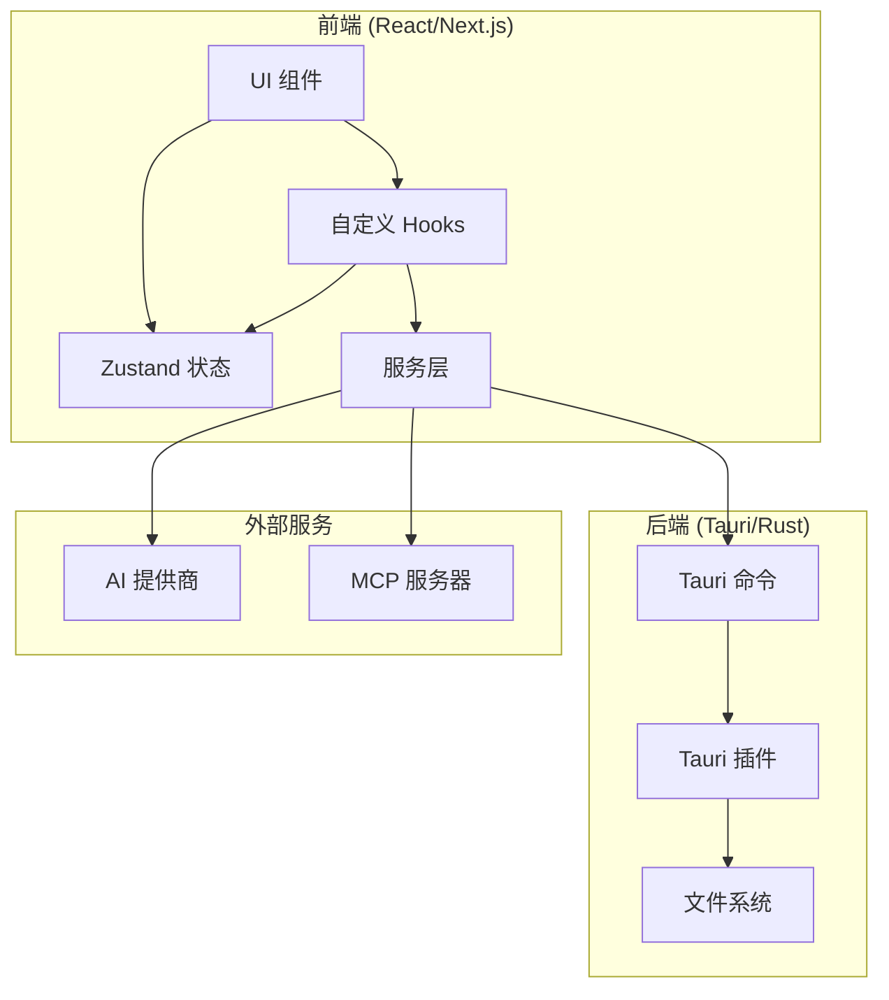
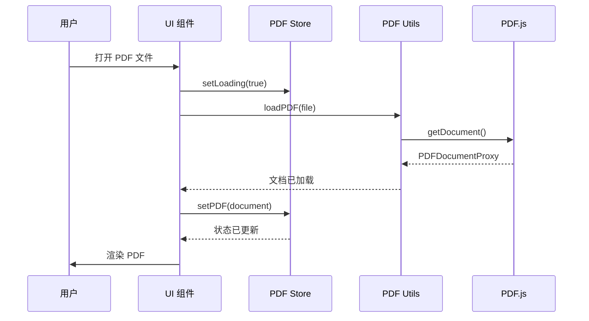
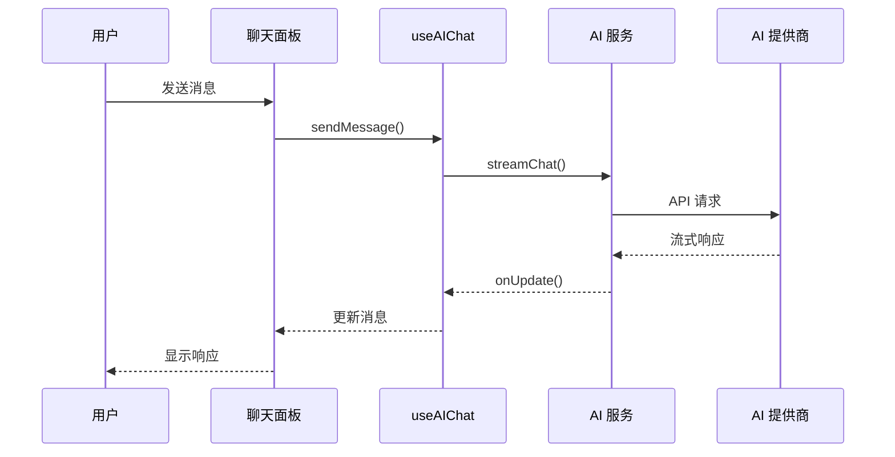

# 架构概述

SAST Readium 采用现代化、模块化的架构，支持从单一代码库同时部署 Web 和桌面应用。

## 高层架构



## 核心技术

### 前端技术栈

| 技术                | 用途                        |
| ------------------- | --------------------------- |
| **Next.js 16**      | React 框架，使用 App Router |
| **React 19**        | UI 组件库                   |
| **TypeScript**      | 类型安全的 JavaScript       |
| **Tailwind CSS v4** | 实用优先的 CSS 框架         |
| **shadcn/ui**       | 可访问的 UI 组件            |
| **Zustand**         | 轻量级状态管理              |
| **PDF.js**          | PDF 渲染引擎                |
| **react-i18next**   | 国际化                      |

### 桌面技术栈

| 技术          | 用途              |
| ------------- | ----------------- |
| **Tauri 2.9** | 桌面应用框架      |
| **Rust**      | 后端语言          |
| **WebView**   | 原生渲染 Web 内容 |

### AI 技术栈

| 技术              | 用途         |
| ----------------- | ------------ |
| **Vercel AI SDK** | AI 集成框架  |
| **MCP 协议**      | 工具集成标准 |
| **Zod**           | 模式验证     |

## 应用层次

### 1. 表现层

按功能组织的 React 组件：

- `components/pdf-viewer/` - PDF 查看和交互
- `components/ai-sidebar/` - AI 聊天界面
- `components/ui/` - 可复用 UI 原语
- `components/welcome-page/` - 初始欢迎屏幕

### 2. 状态层

用于应用状态的 Zustand 存储：

- `lib/pdf-store.ts` - PDF 文档状态、注释、书签
- `lib/ai-chat-store.ts` - AI 对话历史、设置
- `lib/custom-theme-store.ts` - 自定义主题定义

### 3. 服务层

业务逻辑和外部集成：

- `lib/ai-service.ts` - AI 文本生成、工具调用
- `lib/pdf-utils.ts` - PDF.js 包装工具
- `lib/tauri-bridge.ts` - Tauri 命令包装器
- `lib/mcp-client.ts` - MCP 协议客户端

### 4. 平台层

平台特定实现：

- **Web**：Service Workers、IndexedDB、Web APIs
- **桌面**：Tauri 命令、原生文件系统、OS 集成

## 数据流

### PDF 加载流程



### AI 聊天流程



## 平台抽象

SAST Readium 使用平台抽象层来支持 Web 和桌面：

```typescript
// lib/tauri-bridge.ts
export async function openFile(): Promise<File | null> {
  if (isTauri()) {
    // 使用 Tauri 文件对话框
    const path = await open({
      filters: [{ name: "PDF", extensions: ["pdf"] }],
    });
    return readFile(path);
  } else {
    // 使用浏览器文件输入
    return showFilePicker();
  }
}
```

### 平台检测

```typescript
export function isTauri(): boolean {
  return typeof window !== "undefined" && "__TAURI__" in window;
}
```

## 安全模型

### Web 安全

- 内容安全策略 (CSP) 头
- 生产环境仅 HTTPS
- 安全 Cookie 处理
- 通过 React 防止 XSS

### 桌面安全

- 最小化 Tauri 能力
- 限定范围的文件系统访问
- 无任意命令执行
- 安全 IPC 通信

### API 密钥安全

- 密钥存储在浏览器的 Web Crypto API（Web）
- OS 凭证管理（桌面）
- 永不在客户端代码中暴露
- 服务端使用环境变量

## 性能考虑

### PDF 渲染

- 大型文档的虚拟滚动
- 页面级延迟加载
- 已渲染页面的 Canvas 缓存
- Web Workers 处理重型操作

### 状态管理

- Zustand 的最小重渲染方法
- 选择性状态订阅
- localStorage 持久化中间件
- 防抖状态更新

### 包优化

- Next.js 自动代码分割
- 大型组件动态导入
- 未使用代码的 Tree Shaking
- Next.js 图像优化
