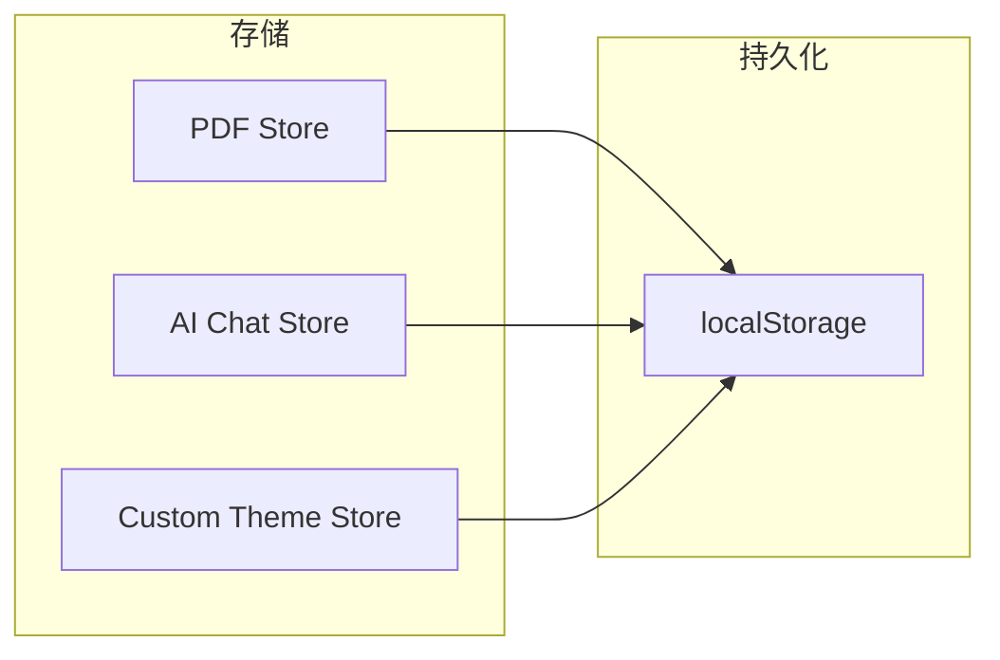

# 状态管理

SAST Readium 使用 [Zustand](https://zustand-demo.pmnd.rs/) 进行状态管理，提供轻量级、TypeScript 友好的方法，并内置持久化支持。

## 为什么选择 Zustand？

- **最小样板代码**：无需 providers、reducers 或 actions
- **TypeScript 优先**：优秀的类型推断
- **选择性订阅**：组件仅在其订阅的状态变化时重新渲染
- **持久化**：内置 localStorage 中间件
- **DevTools**：Redux DevTools 集成

## 存储架构



## PDF Store

PDF 文档状态的主存储，位于 `lib/pdf-store.ts`。

### 状态结构

```typescript
interface PDFState {
  // 文档
  pdfUrl: string | null;
  numPages: number;
  currentPage: number;
  metadata: PDFMetadata | null;

  // 视图设置
  zoom: number;
  rotation: number;
  viewMode: "single" | "continuous" | "twoPage";
  fitMode: "custom" | "fitWidth" | "fitPage";
  themeMode: "light" | "dark" | "sepia" | "auto";

  // UI 状态
  isFullscreen: boolean;
  showThumbnails: boolean;
  showOutline: boolean;
  showAnnotations: boolean;

  // 注释
  annotations: Annotation[];
  annotationHistory: AnnotationHistory;

  // 书签
  bookmarks: Bookmark[];

  // 搜索
  searchQuery: string;
  searchResults: SearchResult[];
}
```

### 操作

```typescript
interface PDFActions {
  // 导航
  setCurrentPage: (page: number) => void;
  nextPage: () => void;
  previousPage: () => void;

  // 缩放
  setZoom: (zoom: number) => void;
  zoomIn: () => void;
  zoomOut: () => void;

  // 注释
  addAnnotation: (annotation: Annotation) => void;
  deleteAnnotation: (id: string) => void;
  undoAnnotation: () => void;
  redoAnnotation: () => void;

  // 书签
  addBookmark: (bookmark: Bookmark) => void;
  deleteBookmark: (id: string) => void;
}
```

### 使用示例

```typescript
import { usePDFStore } from "@/lib/pdf-store";

function PageNavigator() {
  // 订阅特定状态
  const currentPage = usePDFStore((state) => state.currentPage);
  const numPages = usePDFStore((state) => state.numPages);
  const nextPage = usePDFStore((state) => state.nextPage);

  return (
    <div>
      <span>{currentPage} / {numPages}</span>
      <button onClick={nextPage}>下一页</button>
    </div>
  );
}
```

### 持久化

PDF store 将选定状态持久化到 localStorage：

```typescript
export const usePDFStore = create<PDFState & PDFActions>()(
  persist(
    (set, get) => ({
      // ... 状态和操作
    }),
    {
      name: "pdf-store",
      partialize: (state) => ({
        // 仅持久化这些字段
        themeMode: state.themeMode,
        viewMode: state.viewMode,
        recentFiles: state.recentFiles,
        bookmarks: state.bookmarks,
      }),
    }
  )
);
```

## AI Chat Store

管理 AI 对话状态，位于 `lib/ai-chat-store.ts`。

### 状态结构

```typescript
interface AIChatState {
  // 对话
  conversations: Conversation[];
  activeConversationId: string | null;

  // 提供商设置
  provider: AIProvider;
  model: string;
  apiKey: string;
  temperature: number;

  // 功能
  enableTools: boolean;
  enableMultiStep: boolean;
  mcpServers: MCPServerConfig[];
}
```

## 最佳实践

### 1. 选择性订阅

仅订阅您需要的状态：

```typescript
// ✅ 好：仅在 currentPage 变化时重新渲染
const currentPage = usePDFStore((state) => state.currentPage);

// ❌ 差：任何状态变化都会重新渲染
const state = usePDFStore();
```

### 2. 浅比较

对对象/数组订阅使用 `shallow`：

```typescript
import { shallow } from "zustand/shallow";

const { annotations, bookmarks } = usePDFStore(
  (state) => ({
    annotations: state.annotations,
    bookmarks: state.bookmarks,
  }),
  shallow
);
```

### 3. 组件外部的操作

无需订阅状态即可访问操作：

```typescript
// 获取操作而不订阅
const addBookmark = usePDFStore.getState().addBookmark;

// 在事件处理器中使用
function handleAddBookmark() {
  addBookmark({ id: nanoid(), pageNumber: 1, title: "我的书签" });
}
```

### 4. 计算值

在选择器中派生值：

```typescript
const hasAnnotations = usePDFStore((state) => state.annotations.length > 0);

const pageAnnotations = usePDFStore((state) =>
  state.annotations.filter((a) => a.pageNumber === state.currentPage)
);
```

## 测试存储

### 模拟存储状态

```typescript
import { usePDFStore } from "@/lib/pdf-store";

beforeEach(() => {
  usePDFStore.setState({
    currentPage: 1,
    numPages: 10,
    annotations: [],
  });
});

test("导航到下一页", () => {
  usePDFStore.getState().nextPage();
  expect(usePDFStore.getState().currentPage).toBe(2);
});
```
