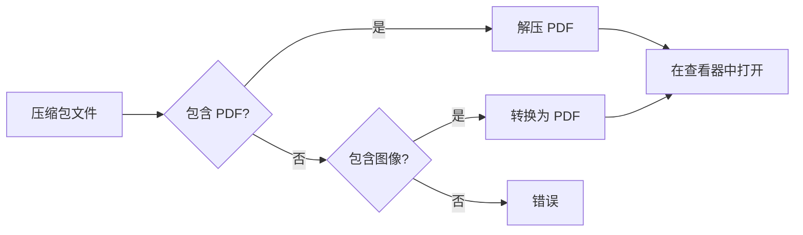

# 压缩包支持

SAST Readium 可以直接从压缩包中打开和阅读 PDF 文件，包括对漫画书格式的支持。

## 支持的格式

| 格式    | 扩展名 | 描述            |
| ------- | ------ | --------------- |
| **ZIP** | `.zip` | 标准 ZIP 压缩包 |
| **CBZ** | `.cbz` | 漫画书 ZIP 格式 |
| **RAR** | `.rar` | RAR 压缩包      |
| **CBR** | `.cbr` | 漫画书 RAR 格式 |

## 工作原理

### 打开压缩包

1. 拖放压缩包文件
2. 或点击"打开文件"选择压缩包
3. SAST Readium 解压并打开内容

### 解压流程



### PDF 解压

如果压缩包包含 PDF 文件：

1. PDF 解压到内存
2. 自动打开第一个 PDF
3. 多个 PDF 显示选择对话框

### 图像转换

对于包含图像的漫画书压缩包 (CBZ/CBR)：

1. 按顺序解压图像
2. 使用 pdf-lib 转换为单个 PDF
3. 保持原始图像质量
4. 保留页面顺序

## 漫画书支持

### CBZ 格式

漫画书 ZIP 文件通常包含：

- 顺序图像文件 (JPG, PNG)
- 按页面顺序命名 (001.jpg, 002.jpg 等)
- 可选元数据文件

### CBR 格式

漫画书 RAR 文件：

- 与 CBZ 结构相同
- 使用 RAR 压缩
- 使用 node-unrar-js 解压

### 图像格式

压缩包中支持的图像类型：

- JPEG (.jpg, .jpeg)
- PNG (.png)
- GIF (.gif)
- WebP (.webp)
- BMP (.bmp)

## 使用方法

### 拖放

1. 将压缩包文件拖到应用窗口
2. 放到拖放区域
3. 等待解压
4. 查看内容

### 文件对话框

1. 点击"打开文件"
2. 从文件选择器选择压缩包
3. 确认选择
4. 内容自动打开

### 最近文件

压缩包出现在最近文件中：

- 显示压缩包名称
- 记住阅读位置
- 快速重新打开

## 技术细节

### ZIP 处理

使用 JSZip 库：

```typescript
import JSZip from "jszip";

async function extractZip(file: File): Promise<File | null> {
  const zip = await JSZip.loadAsync(file);
  // 查找并解压 PDF 或图像
}
```

### RAR 处理

使用 node-unrar-js 在浏览器中处理：

```typescript
import { createExtractorFromData } from "node-unrar-js";

async function extractRar(file: File): Promise<File | null> {
  const extractor = await createExtractorFromData({ data: buffer });
  // 从 RAR 解压文件
}
```

### 图像转 PDF

使用 pdf-lib 进行转换：

```typescript
import { PDFDocument } from "pdf-lib";

async function imagesToPdf(images: Uint8Array[]): Promise<Uint8Array> {
  const pdfDoc = await PDFDocument.create();
  for (const imageData of images) {
    const image = await pdfDoc.embedJpg(imageData);
    const page = pdfDoc.addPage([image.width, image.height]);
    page.drawImage(image, { x: 0, y: 0 });
  }
  return pdfDoc.save();
}
```

## 性能

### 内存使用

- 压缩包在内存中处理
- 大型压缩包可能使用大量 RAM
- 解压内容不缓存到磁盘

### 处理时间

取决于：

- 压缩包大小
- 文件数量
- 压缩级别
- 图像转换（如需要）

### 优化

- 解压期间显示进度指示器
- 尽可能使用流式解压
- 大型压缩包延迟加载

## 限制

### 文件大小

- 非常大的压缩包可能较慢
- 浏览器内存限制适用
- 考虑拆分大型压缩包

### 嵌套压缩包

- 不支持压缩包中的压缩包
- 先解压外层压缩包

### 加密压缩包

- 密码保护的 ZIP：支持
- 密码保护的 RAR：有限支持
- 提示时输入密码

### 文件类型

- 仅解压 PDF 和图像
- 忽略其他文件类型
- 跳过元数据文件

## 最佳实践

### 漫画书

1. 尽可能使用 CBZ 格式（更快）
2. 按顺序命名文件
3. 使用一致的图像大小
4. 压缩前优化图像

### PDF 压缩包

1. 仅包含必要的 PDF
2. 使用描述性文件名
3. 避免深层嵌套文件夹
4. 考虑压缩级别

## 故障排除

### 压缩包无法打开

1. 验证文件未损坏
2. 检查文件扩展名正确
3. 尝试先手动解压
4. 检查浏览器控制台错误

### 图像不转换

1. 验证图像格式支持
2. 检查图像未损坏
3. 确保内存充足
4. 尝试较小的压缩包

### 解压缓慢

1. 检查压缩包大小
2. 关闭其他浏览器标签
3. 尝试不同浏览器
4. 考虑预先解压
